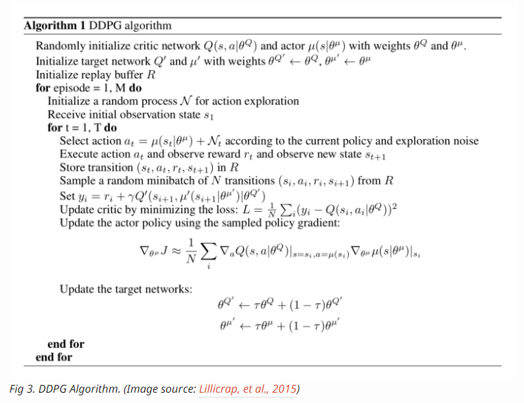
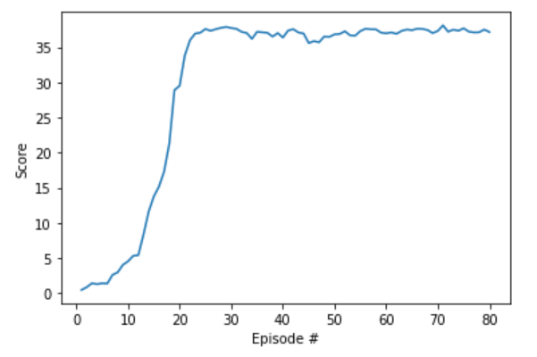
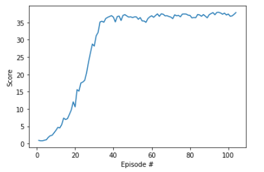

[//]: # "Image References"

[image1]: https://user-images.githubusercontent.com/10624937/43851024-320ba930-9aff-11e8-8493-ee547c6af349.gif "Trained Agent"
[image2]: https://user-images.githubusercontent.com/10624937/43851646-d899bf20-9b00-11e8-858c-29b5c2c94ccc.png "Crawler"


# DDPG (Actor/Critic) Reinforcement Learning using PyTorch and Unity ML -  Reacher Environment Report

### Overview

This project was developed as part of Udacity Deep Reinforcement Learning Nanodegree course. This project solves Reacher environment by training the agent to control robotic arms by positioning them in moving target locations using Deep Deterministic Policy Gradient (DDPG) algorithm. The environment is based on [Unity ML agents](https://github.com/Unity-Technologies/ml-agents). 

### Introduction

For this project, the unity ML [Reacher](https://github.com/Unity-Technologies/ml-agents/blob/master/docs/Learning-Environment-Examples.md#reacher) environment is used and agent is trained to control 20 identical robotic arms to position them in moving target locations

![Trained Agent][image1]

The environment contains 20 identical agents, each with its own copy of the environment. The environment  takes into account the presence of many agents.  In particular, agents must get an average score of +30 (over 100 consecutive episodes, and over all agents).  Specifically,

- After each episode, the rewards that each agent received (without discounting),  is used to get a score for each agent.  This yields 20 (potentially different) scores.  We then take the average of these 20 scores. 
- This yields an **average score** for each episode (where the average is over all 20 agents).

The environment is considered solved, when the average (over 100 episodes) of those average scores is at least +30. 

### Rewards:

In this environment, a double-jointed arm can move to target locations. A reward of +0.1 is provided for each step that the agent's hand is in the goal location. Thus, the goal of your agent is to maintain its position at the target location for as many time steps as possible.

### Environment:

The observation space consists of 33 variables corresponding to position, rotation, velocity, and angular velocities of the arm. Each action is a vector with four numbers, corresponding to torque applicable to two joints. Every entry in the action vector should be a number between -1 and 1.


### Deep Deterministic Policy Gradient Algorithm

DDPG is a model-free off-policy actor-critic algorithm that learns directly from observation spaces. DDPG employs Actor-Critic model, where Actor learns the policy and Critic learns the value function to evaluate the quality of the action chosen by the policy. while Deep Q-Network learns the Q-function using experience replay  and works well in discrete space, DDPG algorithm extends it to  continuous action spaces using Actor-Critic framework while learning policy.




## Model Architecture:

Pendulum-v0 environment with [Deep Deterministic Policy Gradients (DDPG)](https://github.com/udacity/deep-reinforcement-learning/blob/master/ddpg-pendulum/DDPG.ipynb) is used as reference  to build the model.  The model architecture that is used is:

Actor:
	Input(state size of 32) &rarr; Dense Layer(256) &rarr; RELU &rarr; Dense Layer(128) &rarr; RELU &rarr; Dense Layer( action size of 4) &rarr; TANH

Critic:
	Input(state size of 32) &rarr; Dense Layer(256) &rarr; RELU &rarr; Dense Layer(128) &rarr; RELU &rarr; Dense Layer( action size of 4) 

Agent:
	Actor Local and Critic Local networks are trained and updates the Actor Target and Critic Target networks using weighting factor Tau.


### Approach 1:

I started with DDPG pendulum as reference with Single agent to train the Reacher environment. The agent is learning very slowly. After running around 300 episodes, agent got the reward score of 2. I started tuning the environment by adding batch normalization to both Actor / critic and adjusted the hyper parameters.  I noticed only a slight improvement in the results.  

I referred to benchmark implementation page from the course and realized that with a single agent the experience replay buffer is having less variety of SARS tuples and hence the learning from the single agent will take a longer time and episodes  to converge. Hence, I decided to go with Approach 2.

### Approach 2:

To solve the problem in approach 1, I decided to add variety to the experience replay buffer. Having multiple start position for the agents and adding the steps encountered by these 20 agents to experience replay will improve the diversity of sampling and learning.  I started with 20 agents sharing the same replay buffer with different actor and critic models. I ended up with 40 networks to be trained. My computer was taking a lot of time to process the agents. So, I decided to train a single actor (local and target) and critic (local and target) rather than 20 actor and critic environments by sharing the same experience replay buffer. The multi agents environment started with 20 agents with 20 different starting positions and gave a variety of samples for the agent to learn from.  This showed promising results. The above approach coupled with prioritized experience replay resulted in even efficient and faster training by the agent. 

### Hyperparameters and Tuning:

BUFFER_SIZE = int(1e5)  : replay buffer size
BATCH_SIZE = 128        :minibatch size
GAMMA = 0.99            : discount factor
TAU = 2e-3              : for soft update of target parameters
LR_ACTOR = 1e-3         : learning rate of the actor 
LR_CRITIC = 1e-4        : learning rate of the critic
WEIGHT_DECAY = 0        : L2 weight decay
UPDATE_EVERY = 5

In order to speed up learning , I used learning rate for actor as 1e-3 rather than 1e-4 for critic. Also, since I am collecting 20 SARS tuples for each step, I decide to increase the Tau from 1e-3 to 2e-3 to speed up convergence. Since, I increased Tau, I decided to add clipping gradient for critic by adding the line below as suggested in the benchmark implementation page. 

```python
torch.nn.utils.clip_grad_norm(self.critic_local.parameters(), 1)
```

I also tried updating the network every 5 steps and also tuning the weight decay. I did not see significant improvement in the results. 

I decided to tune the network by adding batch normalization and I  noticed little to none improvement in the learning of the agent.  Adjusting the OU noise from random sampling to standard normal improved the learning of the training agent. The above hyperparameters gave good results as can be seen in the results section below

Tuning with Prioritized experienced replay resulted in faster learning. Prioritized replay not only helps in reduces variance by removing perceived correlations between processing transactions but also avoids  in considering transactions with same frequency that are experienced. Prioritized replay helps in replaying more important experiences that occur less frequently. 

### Ideas for Future Work:

Without a doubt, D4PG with Distributed training can definitely speed up the training of the agent as it can gather more variety of tuples to learn.  Also, adjusting the Ornstein-Uhlenbeck noise by adjusting sigma can impact exploration more and can result in efficiently trained agent.  

The algorithms that I consider implementing to enhance DDPG are TRPO (Trust Region Policy Optimization) and PPO (Proximal Policy Optimization). These algorithms are on-policy algorithms unlike DDPG that is off-policy. DDPG algorithms shortcomings related to step size that impacts training process is addressed by TRPO. TRPO is based on actor-critic architecture and varies in how policy parameters of the actor are updated. TRPO  chooses new policy parameters by maximizing expectation subject to KL divergence constraint and automatically corrects the issue related to step size. TRPO uses surrogate objective function that contains the probability ratio between current policy and next policy. TRPO suffers with computational overhead in calculation of second order derivates of KL divergence.  PPO resolves computation by constraining optimization with clipped surrogate objective function that was successfully implemented in variety of continuous places with good results. In our current context, both TRPO and PPO  are good candidates and I will consider implementing PPO over TRPO as it uses less memory and I can train the agent on my personal computer.

## Results:

Results from DDPG training  with prioritized experience replay and experience replay buffer are shared below. The agent trained using prioritized experience replay showed faster and efficient learning than experience replay. The agent with DDPG with prioritized experience replay learned the environment in 24 less episodes than the agent with DDPG and experience replay.

##### DDPG with Prioritized Experience Replay



##### DDPG with Experience Replay


